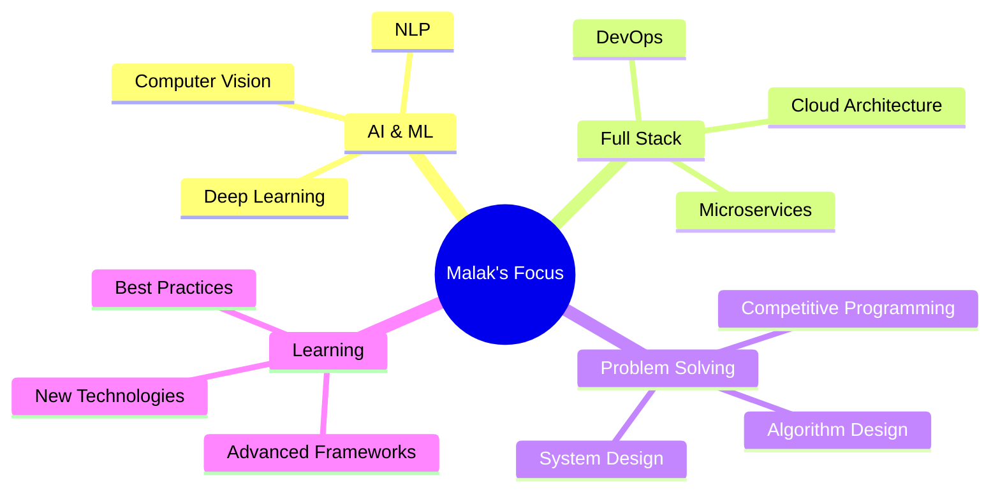

<div align="center">
  
# 👋 Hi, I'm Malak Mahmoud

### 🚀 Computer Science & AI Student | Full Stack Developer | AI Enthusiast


[](https://www.linkedin.com/in/malak-gamil-66b011286)
[](https://github.com/MalakGamil)
[](mailto:malakgamil098@gmail.com)

</div>

---

## 🎯 About Me

```python
class MalakMahmoud:
    def __init__(self):
        self.name = "Malak Mahmoud"
        self.location = "Cairo, Egypt 🇪🇬"
        self.education = "Computer Science & AI @ Cairo University"
        self.gpa = "3.3/4.0"
        self.current_focus = ["AI & Machine Learning", "Full Stack Development", "Problem Solving"]
        self.achievements = {
            "hackathon_rank": "🥇 1st at Faculty, 🥉 3rd Overall - CU-AI Hackathon 2025",
            "problems_solved": "300+ on Codeforces & LeetCode",
            "nti_score": "97.5% - Excellent"
        }
    
    def say_hi(self):
        print("Thanks for dropping by! Let's build something amazing together!")

me = MalakMahmoud()
me.say_hi()
```

- 🔭 Currently working on **AI-powered educational platforms**
- 🌱 Deepening my knowledge in **Microservices Architecture** and **Advanced ML**
- 🎓 Studying **Computer Science and Artificial Intelligence** at Cairo University
- 🏆 **Award-winning** AI project lead with proven track record
- 💡 Passionate about solving real-world problems through technology
- 📫 Reach me at: **malakgamil098@gmail.com**

---

## 🏆 Achievements & Recognition

<div align="center">

| 🎖️ Achievement | 📅 Year | 🔗 Details |
|:---|:---:|:---|
| **🥇 1st Place Faculty Level** | 2025 | CU-AI Hackathon - AI for Natural Sciences |
| **🥉 3rd Place Overall** | 2025 | Cairo University AI Hackathon |
| **⭐ Excellent Grade (97.5%)** | 2025 | NTI Web Design & Freelancing Track |
| **🎯 300+ Problems Solved** | Ongoing | Competitive Programming (Codeforces & LeetCode) |

</div>

---

## 💻 Tech Stack

### Languages


### Frontend Development


### Backend Development


### Databases & Data


### AI & Machine Learning


### Tools & Platforms


---

## 📊 GitHub Statistics

<div align="center">
  


</div>

---

## 🚀 Featured Projects

### 🏆 Award-Winning Projects

<table>
<tr>
<td width="50%">

#### 🎓 [EduClip Platform](https://github.com/MalakGamil)
**AI Project Lead - CU-AI Hackathon Winner**
- 🥇 1st at Faculty Level
- 🥉 3rd Overall at Cairo University
- Automated course creation from scientific textbooks
- Applied advanced ML for classification & processing
- **Tech:** Python, Machine Learning, NLP

</td>
<td width="50%">

#### 🛒 [E-Commerce Shopping System](https://github.com/MalakGamil/E-Commerce_Shoping_System)
**Microservices Architecture**
- Distributed system using Flask microservices
- Secure authentication & order management
- RESTful APIs with SOA principles
- **Tech:** Flask, Java JSP, MySQL, Microservices

</td>
</tr>

<tr>
<td width="50%">

#### 💸 [Speedo Transfer](https://github.com/MalakGamil/Speedo-Transfer)
**Modern Money Transfer App**
- Built with Angular & TypeScript
- Responsive UI with Tailwind CSS
- Real-time transaction processing
- **Tech:** Angular, TypeScript, Tailwind, REST API

</td>
<td width="50%">

#### 🤖 [Material Stream Identification](https://github.com/MalakGamil/MSI_System)
**AI-Powered Waste Sorting**
- Computer Vision + Machine Learning
- Real-time video processing pipeline
- SVM & k-NN classification models
- **Tech:** Python, OpenCV, SVM, k-NN

</td>
</tr>

<tr>
<td width="50%">

#### 📚 [Learning Management System](https://github.com/MalakGamil/LMS_Project)
**Enterprise-Grade LMS**
- Scalable Spring Boot backend
- Role-based access control (RBAC)
- Comprehensive unit testing with JUnit
- **Tech:** Java, Spring Boot, MySQL, JUnit

</td>
<td width="50%">

#### 📊 [Crime Data Warehouse](https://github.com/MalakGamil/Registra)
**Business Intelligence Solution**
- Star Schema architecture
- ETL pipelines using SSIS
- Optimized analytical queries
- **Tech:** SQL Server, SSIS, Power Query

</td>
</tr>
</table>

### 💡 More Projects

- 🔐 **[Registra](https://github.com/MalakGamil/Registra)** - Secure registration system with Laravel
- 🖥️ **[CPU Scheduling Simulator](https://github.com/MalakGamil/CPU-Scheduling-Simulator)** - Algorithm simulation in Java

---

## 📈 Contribution Graph

<div align="center">
  


</div>

---

## 🎯 Current Focus



---

## 📜 Certifications & Training

- 🎖️ **CU-AI Hackathon 2025** - AI Project Lead Certificate ([View](https://drive.google.com/file/d/1n_W46pAkFmNdTUZuzSberM5d05UuuKHD/view))
- 🌐 **NTI Web Design Internship** - 90+ hours, 97.5% Score ([View](https://drive.google.com/file/d/1T4jrv5sfpp8yiDPBhPigxyrvQCJ6laUP/view))
- 💾 **Database Workshop** - Minders, Relational DB Design & Optimization

---

## 🎓 Education

**Bachelor of Computer Science and Artificial Intelligence**  
Cairo University | 2022 - 2026  
GPA: 3.3/4.0

---

## 🤝 Let's Connect!

<div align="center">

I'm always interested in collaborating on innovative projects, especially in **AI**, **Full Stack Development**, and **Data Science**!

[](https://www.linkedin.com/in/malak-gamil-66b011286)
[](mailto:malakgamil098@gmail.com)
[](https://github.com/MalakGamil)

### 💭 "Code is like humor. When you have to explain it, it's bad." - Cory House

---


**⭐ From [MalakGamil](https://github.com/MalakGamil) with ❤️**

</div>
